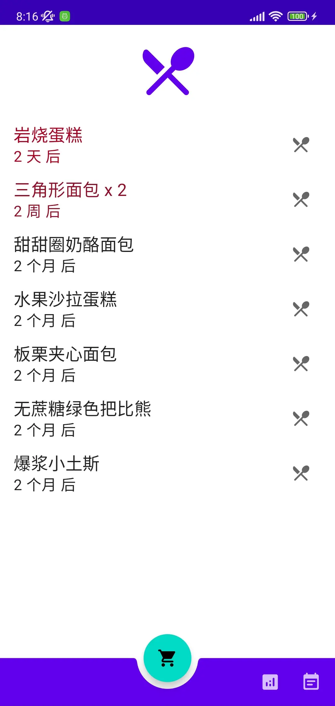
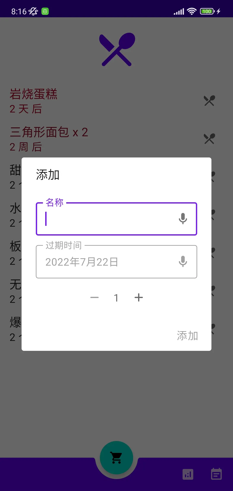

  

<h1 align="center">过期啦</h1>

  <strong>一款管理过期商品的Android应用。</strong>
   
  支持商品的增删查改，并用渐变红色标记快过期的商品。

 

|列表|添加|
|:-:|:-:|
|||

[Release中有下载链接。](https://github.com/DeweyReed/Expired/releases)

## 应用架构

Kotlin实现的MVVM，还有Coroutines, Dagger Hilt、Room、DataStore。

## 语音输入

可以用语音输入名称和日期。应用会调用系统语音识别的接口，暂时只支持简体中文输入。

如果系统默认的接口失效，需要下载一个第三方的语音识别应用。现只知道一个支持简体中文的“讯飞语记”。

支持的日期格式有：今天、明天、后天、大后天、某月某日、某月某号、某月某。

## License

[Apache License 2.0](LICENSE)
